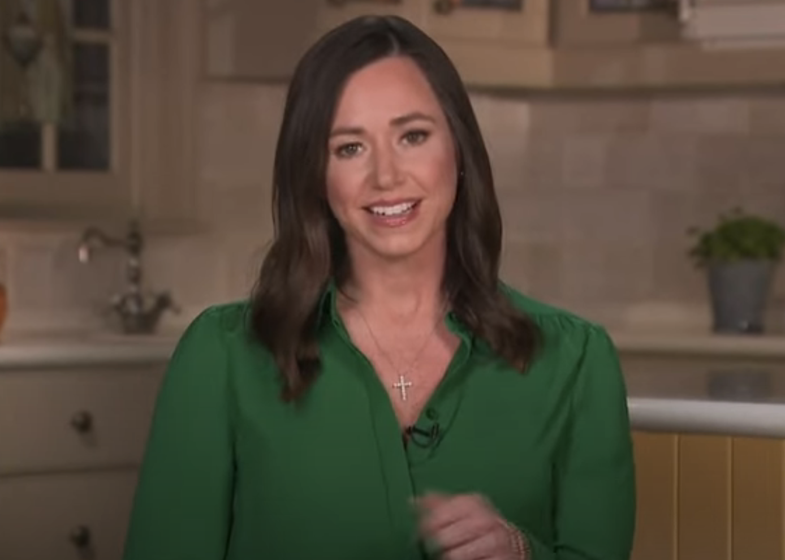

# SuperCut Generator: Create Your Own Supercut Video

This collection of python and shell scripts allows you to create and edit your own supercut videos using only code, leveraging powerful libraries and software like `yt-dlp`, `mpv`, `whisper.cpp`, and `FFmpeg`. It's always "easier" to launch AfterEffects or FCP, but this way unlocks the precision of code-driven supercuts!

Another way to achieve this is through a great tool like [Videogrep](https://github.com/antiboredom/videogrep) which relies on [Moviepy](https://zulko.github.io/moviepy/). I've used those for years and wanted to create an alternative for myself based on the LLM-based transcription tools available now.

<a href="https://www.youtube.com/watch?v=h3QYCayLHtg">
	
</a>

## Requirements

Before you start, ensure you have the following prerequisites installed on your system:

- `yt-dlp`
- `mpv`
- `whisper.cpp`
- `FFmpeg`

You can install `yt-dlp` and `mpv` using pip:

```bash
pip install yt-dlp
pip install mpv
```

For `whisper.cpp` and `FFmpeg`, please follow the installation guides on their GitHub repositories:

- [whisper.cpp GitHub repository](https://github.com/ggerganov/whisper.cpp)
- [FFmpeg GitHub repository](https://github.com/FFmpeg/FFmpeg)

## Getting Started

### Step 0: Download Your Source Video

Use `yt-dlp` to download your source video in the best available quality:

```bash
yt-dlp -f bestvideo+bestaudio/best xfKCWMG4O0I -o video/britt_1080.mp4
```

### Step 1: Extract Audio for Transcription

Convert the video's audio to a 16kHz WAV file compatible with whisper.cpp:

```bash
ffmpeg -i video/britt_1080.mp4 -ar 16000 -ac 1 audio/britt_audio.wav
```

### Step 2: Generate Timings by Word

Run `02_timings_by_word.sh` to create three types of transcripts in an output directory:

- Sentence level (sow)
- 16 characters at a time (16)
- Word level (01)

Make sure to grant execution permissions to the script:

```bash
chmod 755 02_timings_by_word.sh
```

### Step 3: Find and Transform Timings

Identify the timings of the words or phrases you want to use in your video from the txt files (`16`, `01`, `sow`). Transform these timings to a format usable by another script using `03_transform_timings.py`:

1. Paste the lines into `03_transform_timings_input_lines.txt`.
2. Run the script and copy the output.

```bash
python3 03_transform_timings.py
```

### Step 4: Preview and Adjust Clips

Paste the output from the previous step into `04_mpv_preview_timings.sh` and run it to preview your clips. If necessary, adjust the timings manually in the script until the preview looks right.

```bash
chmod 755 04_mpv_preview_timings.sh
./04_mpv_preview_timings.sh
```

### Step 5: Concatenate Your Supercut

Finally, run `05_final_step_concat.sh` to compile your supercut video:

```bash
chmod 755 05_final_step_concat.sh
./05_final_step_concat.sh
```

Your video will be saved as `video/final_output.mp4`.

## Additional Tools

For an analysis of word usage within your video, and to get a better understanding of what's available linguistically, try running `99_word_usage.py`:

```bash
python3 99_word_usage.py
```

## Conclusion

Congratulations! You've successfully created a supercut video using code. Experiment with different videos and phrases to create unique and personalized supercuts. Happy coding! (This markdown file was written with [Markdown Maestro](https://chat.openai.com/g/g-hCcO6EWyp-markdown-maestro).)
